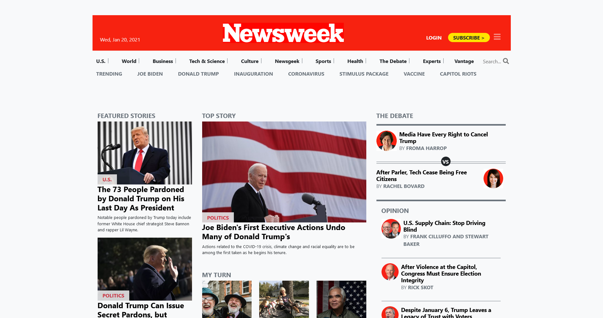

# Project3: Newsweek-Project

> Project 3: Using Bootstrap -
The goal of this project is to build a clone of the Newsweek web page using Bootstrap framework .

Project requirements included instalation of Bootstrap in our project, and preparing project to work with 3 screen sizes: mobile, tablet, and desktop using the Bootstrap.

## Built With

- HTML5
- CSS3
- CSS Bootstrap framework

## Live Demo

[Live Demo Link](https://shinobiwarior.github.io/Newsweek-Project/)

## Getting Started

No prerequisites

To get  a local copy:
 
- Cloning repository:
 1. Press the green button "Code" and copy the link bellow
 2. Then open terminal or Git Bash in a folder where you want to copy the repository
 3. Type command "git clone" and paste the address that you copied
 4. Press "Enter"
 5. Find the "index.html" file and double click on it
- Download zip file:
 1. Press the green button "Code" and press "Download ZIP"
 2. Save the file and extract it in any folder you wish
 3. Find the "index.html" file in extracted file and double click on it
  
To run it online just click on [Live Demo Link](https://shinobiwarior.github.io/Cake-Factory/)

## Authors

👤 **Aleksandar Ivezic**

- GitHub: [Aleksandar Ivezic](https://github.com/ShinobiWarior)
- Twitter: [@Aivezic](https://twitter.com/Aivezic)
- LinkedIn: [Aleksandar Ivezic](https://www.linkedin.com/in/aleksandar-ivezi%C4%87-1a6b0391/)

👤 **Emmanuel Obonyo**

- GitHub: [@emmyobonyo](https://github.com/emmyobonyo)

## 🤝 Contributing

Contributions, issues, and feature requests are welcome!

Feel free to check the [issues page](https://github.com/ShinobiWarior/Newsweek-Project/issues).

## Show your support

Give a ⭐️ if you like this project!
